<!--
generated from cortex v1
model digest 31795f723c86656bf6d6a74e26d2d9bb4f157af48aec0e473f81b5d27fe09b0d
contract digest 67460d1c95616f7c92518f66c1009b48d221b2f65c56c9a886db3de45a1d2732
do not edit: regenerate with `ess generate`
-->

# cortex v1

Spin up knowledge brains from a spec. Each instance is one EKR store fed on a schedule by the data sources its spec connects: web pages found by search or crawled from listed sites, records of any Connectors operation, and local files. Secrets never pass through cortex; a source names a Connectors connection and only invokes operations through it.

## The system as a graph

```mermaid
flowchart TB
    subgraph who["who may ask"]
        who0["cortex.instance.Operator"]
        who1["cortex.instance.Scheduler"]
    end
    subgraph unit0["cortex"]
        cmd0["cortex.instance.AddSource"]
        cmd1["cortex.instance.AdoptInstance"]
        cmd2["cortex.instance.CreateInstance"]
        cmd3["cortex.instance.EnableSource"]
        cmd4["cortex.instance.RecordFailure"]
        cmd5["cortex.instance.RemoveInstance"]
        cmd6["cortex.instance.RestoreSnapshot"]
        cmd7["cortex.instance.RunSource"]
        cmd8["cortex.instance.UpdateInstance"]
        evt0["cortex.instance.InstanceAdopted"]
        evt1["cortex.instance.InstanceCreated"]
        evt2["cortex.instance.InstanceRemoved"]
        evt3["cortex.instance.InstanceUpdated"]
        evt4["cortex.instance.RunFailed"]
        evt5["cortex.instance.SnapshotRestored"]
        evt6["cortex.instance.SourceAdded"]
        evt7["cortex.instance.SourceDisabled"]
        evt8["cortex.instance.SourceEnabled"]
        evt9["cortex.instance.SourceRan"]
    end
    who0 -->|"may invoke"| cmd0
    who0 -->|"may invoke"| cmd1
    who0 -->|"may invoke"| cmd2
    who0 -->|"may invoke"| cmd3
    who0 -->|"may invoke"| cmd5
    who0 -->|"may invoke"| cmd6
    who0 -->|"may invoke"| cmd8
    who1 -->|"may invoke"| cmd4
    who1 -->|"may invoke"| cmd7
    cmd0 -->|"added"| evt6
    cmd1 -->|"adopted"| evt0
    cmd2 -->|"partial"| evt1
    cmd2 -->|"created"| evt1
    cmd3 -->|"enabled"| evt8
    cmd4 -->|"disabled"| evt7
    cmd4 -->|"counted"| evt4
    cmd5 -->|"removed"| evt2
    cmd6 -->|"restored"| evt5
    cmd7 -->|"ran"| evt9
    cmd8 -->|"updated"| evt3
```

A command is accepted by the component that owns its context, emits the events one of its outcomes declares, and a dashed edge is a binding carrying an event into the next command. Design §9 begins one step earlier, at the actor who invokes the first command, and so does this graph: a solid edge out of an actor is a grant, and an actor drawn with no edge at all may invoke nothing — which is something the model says, not an arrow somebody forgot.

## Bounded contexts

- **[Instances](domains/cortex-instance.md)** (`cortex.instance`) — Instances of a knowledge brain and the data sources that feed them. An instance owns one EKR store, created from the instance spec's seed. A source fetches documents on its own schedule, keeps those that are new or changed, has a model extract them into an EKR extraction document and applies it to the instance's store. 48 types, three entities, two views, nine commands, 10 events, 19 errors and two actors.

## Components

A component is a unit of ownership, not a deployment. How many of each runs, and what each needs, is [the topology](topology.md).

**`cortex`** — The operator's command line: create, update, run and remove instances, and switch a source off and on. A systemd user timer per source calls the same binary. It owns [`cortex.instance`](domains/cortex-instance.md). It accepts `cortex.instance.AddSource`, `cortex.instance.AdoptInstance`, `cortex.instance.CreateInstance`, `cortex.instance.EnableSource`, `cortex.instance.RecordFailure`, `cortex.instance.RemoveInstance`, `cortex.instance.RestoreSnapshot`, `cortex.instance.RunSource` and `cortex.instance.UpdateInstance`. It publishes `cortex.instance.InstanceAdopted`, `cortex.instance.InstanceCreated`, `cortex.instance.InstanceRemoved`, `cortex.instance.InstanceUpdated`, `cortex.instance.RunFailed`, `cortex.instance.SnapshotRestored`, `cortex.instance.SourceAdded`, `cortex.instance.SourceDisabled`, `cortex.instance.SourceEnabled` and `cortex.instance.SourceRan`.

## The other pages

| page | what is on it |
|---|---|
| [Instances](domains/cortex-instance.md) | the `cortex.instance` vocabulary: its types, entities, views, commands, events, errors and actors |
| [Interactions](interactions.md) | every binding, with what it guarantees and what happens when it fails |
| [Type crossings](crossings.md) | every conversion this system permits, and the reason someone gave for it |
| [Topology](topology.md) | what each component needs in order to run |

---

Generated from cortex v1 · model digest `31795f723c86656bf6d6a74e26d2d9bb4f157af48aec0e473f81b5d27fe09b0d` · contract digest `67460d1c95616f7c92518f66c1009b48d221b2f65c56c9a886db3de45a1d2732`. Do not edit this file; change the specification and regenerate it with `ess generate`.
