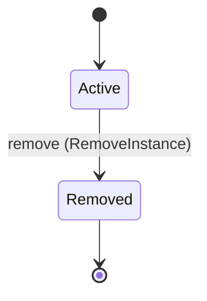
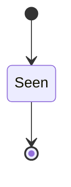
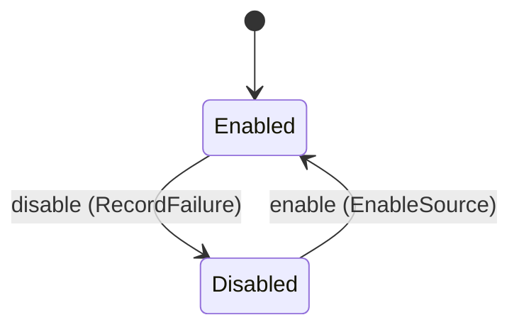

<!-- generated by cortex-docs, do not edit -->

Instances of a knowledge brain and the data sources that feed them. An instance owns one EKR store, created from the instance spec's seed. A source fetches documents on its own schedule, keeps those that are new or changed, has a model extract them into an EKR extraction document and applies it to the instance's store.

`cortex.instance` is one of cortex's bounded contexts. [All domains](./index.mdx).

## Types

### `ChangeDetection`

`cortex.instance.ChangeDetection` is one of `ContentHash`.

### `ChildCall`

`cortex.instance.ChildCall` is a record of four fields:

- `operation` — `String`
- `input` — `Json`
- `records` — `String`
- `paging` — `Optional<cortex.instance.Paging>`, which may be absent

### `ConnectorsSource`

`cortex.instance.ConnectorsSource` is a record of 10 fields:

- `adapter` — `String`
- `connection` — `String`
- `operation` — `String`
- `inputs` — `List<Json>`
- `records` — `String`
- `id` — `String`
- `time` — `Optional<String>`, which may be absent
- `text` — `List<String>`
- `paging` — `Optional<cortex.instance.Paging>`, which may be absent
- `child` — `Optional<cortex.instance.ChildCall>`, which may be absent

### `CrawlPolicy`

`cortex.instance.CrawlPolicy` is a record of seven fields:

- `max_depth` — `Integer`
- `max_breadth` — `Integer`
- `limit` — `Integer`
- `select_paths` — `List<String>`
- `exclude_paths` — `List<String>`
- `instructions` — `Optional<String>`, which may be absent
- `allow_external` — `Boolean`

### `DocumentId`

`cortex.instance.DocumentId` wraps `String` and is not interchangeable with one: the whole value of naming it separately is the crossings the model then refuses.

### `DropPolicy`

`cortex.instance.DropPolicy` is one of `Keep` and `Supersede`.

### `EkrPin`

`cortex.instance.EkrPin` is a record of two fields:

- `version` — `String`
- `bin` — `Optional<String>`, which may be absent

### `FetchPolicy`

`cortex.instance.FetchPolicy` is a record of four fields:

- `refresh_after_days` — `Integer`
- `change` — `cortex.instance.ChangeDetection`
- `max_documents_per_run` — `Integer`
- `max_chars_per_document` — `Integer`

### `FileRecords`

`cortex.instance.FileRecords` is a record of seven fields:

- `format` — `cortex.instance.RecordFormat`
- `id` — `String`
- `time` — `Optional<String>`, which may be absent
- `author` — `Optional<String>`, which may be absent
- `text` — `List<String>`
- `thread` — `Optional<String>`, which may be absent
- `filters` — `List<cortex.instance.RecordFilter>`

### `FilesSource`

`cortex.instance.FilesSource` is a record of three fields:

- `paths` — `List<String>`
- `glob` — `String`
- `records` — `Optional<cortex.instance.FileRecords>`, which may be absent

### `GateCheck`

`cortex.instance.GateCheck` is a record of three fields:

- `measure` — `String`
- `min` — `Optional<Decimal>`, which may be absent
- `max` — `Optional<Decimal>`, which may be absent

### `InstanceName`

`cortex.instance.InstanceName` wraps `String` and is not interchangeable with one: the whole value of naming it separately is the crossings the model then refuses.

### `InstanceSpec`

`cortex.instance.InstanceSpec` is a record of 12 fields:

- `format` — `String`
- `name` — `cortex.instance.InstanceName`
- `description` — `String`
- `ekr` — `cortex.instance.EkrPin`
- `seed` — `cortex.instance.SeedSpec`
- `model` — `cortex.instance.ModelSpec`
- `sources` — `List<cortex.instance.SourceSpec>`
- `serve` — `cortex.instance.ServeSpec`
- `store` — `Optional<cortex.instance.StoreSpec>`, which may be absent
- `redaction` — `Optional<cortex.instance.RedactionPolicy>`, which may be absent
- `snapshots` — `Optional<cortex.instance.SnapshotPolicy>`, which may be absent
- `gate` — `Optional<cortex.instance.RunGate>`, which may be absent

### `ModelBackend`

`cortex.instance.ModelBackend` is one of `Claude` and `Codex`.

### `ModelSpec`

`cortex.instance.ModelSpec` is a record of five fields:

- `model` — `String`
- `backend` — `Optional<cortex.instance.ModelBackend>`, which may be absent
- `budget_usd` — `Decimal`
- `timeout_s` — `Integer`
- `instructions` — `Optional<String>`, which may be absent

### `PageStyle`

`cortex.instance.PageStyle` is one of `PageNumber`, `Token` and `Keyset`.

### `Paging`

`cortex.instance.Paging` is a record of four fields:

- `style` — `cortex.instance.PageStyle`
- `param` — `String`
- `next` — `Optional<String>`, which may be absent
- `max_pages` — `Integer`

### `PostgresStore`

`cortex.instance.PostgresStore` is a record of one field:

- `config` — `String`

### `PropertyMapping`

`cortex.instance.PropertyMapping` is a record of two fields:

- `property` — `String`
- `path` — `String`

### `RecordFilter`

`cortex.instance.RecordFilter` is a record of three fields:

- `field` — `String`
- `values` — `List<String>`
- `include` — `Boolean`

### `RecordFormat`

`cortex.instance.RecordFormat` is one of `WholeFile`, `JsonLines` and `MarkdownSections`.

### `RecordMapping`

`cortex.instance.RecordMapping` is a record of six fields:

- `node_type` — `String`
- `id` — `String`
- `name` — `String`
- `aliases` — `List<String>`
- `properties` — `List<cortex.instance.PropertyMapping>`
- `relations` — `List<cortex.instance.RelationMapping>`

### `RedactionClass`

`cortex.instance.RedactionClass` is one of `Email`, `Phone`, `IpAddress`, `PaymentCard`, `Url`, `Credential` and `RareName`.

### `RedactionPolicy`

`cortex.instance.RedactionPolicy` is a record of five fields:

- `classes` — `List<cortex.instance.RedactionClass>`
- `rules` — `List<cortex.instance.RedactionRule>`
- `known_names` — `Optional<List<String>>`, which may be absent
- `rare_limit` — `Optional<Integer>`, which may be absent
- `refuse_if_left` — `Optional<List<cortex.instance.RedactionClass>>`, which may be absent

### `RedactionRule`

`cortex.instance.RedactionRule` is a record of three fields:

- `name` — `String`
- `pattern` — `String`
- `replacement` — `String`

### `RelationMapping`

`cortex.instance.RelationMapping` is a record of three fields:

- `relation` — `String`
- `target_type` — `String`
- `target_name` — `String`

### `RunGate`

`cortex.instance.RunGate` is a record of one field:

- `checks` — `List<cortex.instance.GateCheck>`

### `SearchInput`

`cortex.instance.SearchInput` is a record of two fields:

- `queries` — `List<String>`
- `policy` — `cortex.instance.SearchPolicy`

### `SearchPolicy`

`cortex.instance.SearchPolicy` is a record of seven fields:

- `topic` — `cortex.instance.SearchTopic`
- `time_range` — `Optional<cortex.instance.TimeRange>`, which may be absent
- `max_results` — `Integer`
- `include_domains` — `List<String>`
- `exclude_domains` — `List<String>`
- `country` — `Optional<String>`, which may be absent
- `language` — `Optional<String>`, which may be absent

### `SearchTopic`

`cortex.instance.SearchTopic` is one of `general` and `news`.

### `SeedSpec`

`cortex.instance.SeedSpec` is a record of three fields:

- `schema` — `Optional<String>`, which may be absent
- `ekr_seed` — `Optional<String>`, which may be absent
- `documents` — `List<String>`

### `ServeSpec`

`cortex.instance.ServeSpec` is a record of one field:

- `view_port` — `Optional<Integer>`, which may be absent

### `SitesInput`

`cortex.instance.SitesInput` is a record of three fields:

- `urls` — `List<String>`
- `mode` — `cortex.instance.WebMode`
- `policy` — `Optional<cortex.instance.CrawlPolicy>`, which may be absent

### `SnapshotPolicy`

`cortex.instance.SnapshotPolicy` is a record of one field:

- `keep` — `Integer`

### `SourceId`

`cortex.instance.SourceId` wraps `String` and is not interchangeable with one: the whole value of naming it separately is the crossings the model then refuses.

### `SourceKind`

`cortex.instance.SourceKind` is one of `Web`, `Connectors`, `Files` and `Structured`.

### `SourceSettings`

`cortex.instance.SourceSettings` is one of four shapes, told apart by a `kind` field — tagged, so a decoder never has to guess which branch it is reading:

- `connectors` — `cortex.instance.ConnectorsSource`
- `files` — `cortex.instance.FilesSource`
- `structured` — `cortex.instance.StructuredSource`
- `web` — `cortex.instance.WebSource`

### `SourceSpec`

`cortex.instance.SourceSpec` is a record of four fields:

- `name` — `String`
- `schedule` — `String`
- `settings` — `cortex.instance.SourceSettings`
- `policy` — `cortex.instance.FetchPolicy`

### `SqliteStore`

`cortex.instance.SqliteStore` is a record of one field:

- `path` — `Optional<String>`, which may be absent

### `StoreSpec`

`cortex.instance.StoreSpec` is one of two shapes, told apart by a `backend` field — tagged, so a decoder never has to guess which branch it is reading:

- `postgres` — `cortex.instance.PostgresStore`
- `sqlite` — `Optional<cortex.instance.SqliteStore>`

### `StructuredConnectors`

`cortex.instance.StructuredConnectors` is a record of five fields:

- `adapter` — `String`
- `connection` — `String`
- `operation` — `String`
- `inputs` — `List<Json>`
- `paging` — `Optional<cortex.instance.Paging>`, which may be absent

### `StructuredFiles`

`cortex.instance.StructuredFiles` is a record of two fields:

- `paths` — `List<String>`
- `glob` — `String`

### `StructuredInput`

`cortex.instance.StructuredInput` is one of two shapes, told apart by a `from` field — tagged, so a decoder never has to guess which branch it is reading:

- `connectors` — `cortex.instance.StructuredConnectors`
- `files` — `cortex.instance.StructuredFiles`

### `StructuredSource`

`cortex.instance.StructuredSource` is a record of four fields:

- `input` — `cortex.instance.StructuredInput`
- `records` — `String`
- `mapping` — `cortex.instance.RecordMapping`
- `dropped` — `Optional<cortex.instance.DropPolicy>`, which may be absent

### `TimeRange`

`cortex.instance.TimeRange` is one of `day`, `week`, `month` and `year`.

### `WebInput`

`cortex.instance.WebInput` is one of two shapes, told apart by a `input` field — tagged, so a decoder never has to guess which branch it is reading:

- `search` — `cortex.instance.SearchInput`
- `sites` — `cortex.instance.SitesInput`

### `WebMode`

`cortex.instance.WebMode` is one of `Pages` and `Crawl`.

### `WebSource`

`cortex.instance.WebSource` is a record of three fields:

- `adapter` — `Optional<String>`, which may be absent
- `connection` — `String`
- `input` — `cortex.instance.WebInput`

## Entities

An entity is what this context is about: something with an identity that outlives any one request, a shape, and a lifecycle. The lifecycle is exhaustive — a move that is not drawn below is a move this specification does not permit, and that is the only way it says so. Every move is labelled with the command that takes it, because a move nothing can trigger is refused rather than drawn.

### `Instance`

`cortex.instance.Instance`.

An instance is identified by `name`, a `cortex.instance.InstanceName`. The name is part of the model and not a convention: a view projects the identity under that name, so a projection inventing its own would disagree with the view.

It holds:

- `description` — `String`
- `model` — `String`
- `ekr_version` — `String`
- `seed_digest` — `String`

It owns any number of [`Source`](#source), as `sources`, carried by `Source.instance_name`.

No invariant is declared, so nothing here constrains an instance at rest.

Its state is a `cortex.instance.Instance.State`, one of `Active` and `Removed`. That enum is synthesised from the lifecycle rather than declared beside it, so the states a view's filter compares and the states drawn below cannot disagree.

An instance is created in `Active`. `Removed` is terminal, so an instance may rest there forever. That is declared rather than inferred from having no way out: an entity that cannot leave a state is either finished or stuck, and only its author knows which.

Each move is taken by a declared command outcome, and a move nothing takes is refused as `missing_causation` rather than left as a state change nobody can trigger:

- `remove` — taken by `cortex.instance.RemoveInstance` on its `removed` outcome

An instance is brought into existence by `cortex.instance.CreateInstance` on its `created` outcome.

Illegal transitions are illegal by absence: no rule forbids them, there is simply no arrow, because a rule would be a second place for the same truth to live. A diagram cannot show an absence, so the pairs it does not connect are listed here, derived from the same transitions — anything named below is a move this specification does not permit.

- `Removed` may not become `Active`

One view projects it: [`Instances`](#instances).

### `SeenDocument`

`cortex.instance.SeenDocument`.

An instance is identified by `document_id`, a `cortex.instance.DocumentId`. The name is part of the model and not a convention: a view projects the identity under that name, so a projection inventing its own would disagree with the view.

It holds:

- `source_id` — `cortex.instance.SourceId`
- `key` — `String`
- `content_hash` — `String`
- `applied_at` — `Integer`

Its `source_id` is what [`Source`](#source) owns it by, as `seen`.

Every instance satisfies `applied_at >= 0` — a predicate over this entity's own fields, checked against them rather than stored as a sentence, so an invariant reading something the entity does not have is refused instead of documented.

Its state is a `cortex.instance.SeenDocument.State`, one of `Seen`. That enum is synthesised from the lifecycle rather than declared beside it, so the states a view's filter compares and the states drawn below cannot disagree.

An instance is created in `Seen`. `Seen` is terminal, so an instance may rest there forever. That is declared rather than inferred from having no way out: an entity that cannot leave a state is either finished or stuck, and only its author knows which.

It declares no moves, so nothing changes its state once it exists.

It has one state, so there is no move to permit or to forbid.

No view projects it, so nothing outside this context is promised a way to observe one.

### `Source`

`cortex.instance.Source`.

An instance is identified by `source_id`, a `cortex.instance.SourceId`. The name is part of the model and not a convention: a view projects the identity under that name, so a projection inventing its own would disagree with the view.

It holds:

- `instance_name` — `cortex.instance.InstanceName`
- `name` — `String`
- `kind` — `cortex.instance.SourceKind`
- `schedule` — `String`
- `runs` — `Integer`
- `consecutive_failures` — `Integer`

It owns any number of [`SeenDocument`](#seendocument), as `seen`, carried by `SeenDocument.source_id`. Its `instance_name` is what [`Instance`](#instance) owns it by, as `sources`.

Every instance satisfies `runs >= 0` and `consecutive_failures >= 0` — a predicate over this entity's own fields, checked against them rather than stored as a sentence, so an invariant reading something the entity does not have is refused instead of documented.

Its state is a `cortex.instance.Source.State`, one of `Disabled` and `Enabled`. That enum is synthesised from the lifecycle rather than declared beside it, so the states a view's filter compares and the states drawn below cannot disagree.

An instance is created in `Enabled`. No state is terminal: nothing in this lifecycle says an instance may stop moving.

Each move is taken by a declared command outcome, and a move nothing takes is refused as `missing_causation` rather than left as a state change nobody can trigger:

- `disable` — taken by `cortex.instance.RecordFailure` on its `disabled` outcome
- `enable` — taken by `cortex.instance.EnableSource` on its `enabled` outcome

An instance is brought into existence by `cortex.instance.AddSource` on its `added` outcome.

Every ordered pair of these states is connected by some move, so this lifecycle forbids nothing.

One view projects it: [`Sources`](#sources).

## Views

A view is what the outside world is promised it can observe. Each one says which instances it contains and how soon it reflects a command that has already returned, because "you can read this" without "how soon" is the promise every flaky suite is built on.

### `Instances`

`cortex.instance.Instances`, shown to a person as "Instances" and called `list` on the wire.

It reads [`Instance`](#instance).

It contains every instance of that entity: no filter narrows it, which is a decision somebody made and not a line somebody omitted.

It exposes:

- `name` — `cortex.instance.InstanceName`
- `description` — `String`
- `model` — `String`
- `ekr_version` — `String`
- `seed_digest` — `String`
- `state` — `cortex.instance.Instance.State`

It declares no order, so the rows come back in whatever order the implementation has, and two reads may disagree.

**Read-your-writes**: it is current the moment the command that changed it returns. A caller that has just created an invoice and cannot see it in here has been told a lie about what it did.

A generated scenario asserts it once, immediately after the command: a view promising this and not keeping the promise has to fail the suite rather than be retried until it passes.

### `Sources`

`cortex.instance.Sources`, shown to a person as "Sources" and called `sources` on the wire.

It reads [`Source`](#source).

It contains every instance of that entity: no filter narrows it, which is a decision somebody made and not a line somebody omitted.

It exposes:

- `source_id` — `cortex.instance.SourceId`
- `instance_name` — `cortex.instance.InstanceName`
- `name` — `String`
- `kind` — `cortex.instance.SourceKind`
- `schedule` — `String`
- `runs` — `Integer`
- `consecutive_failures` — `Integer`
- `state` — `cortex.instance.Source.State`

It declares no order, so the rows come back in whatever order the implementation has, and two reads may disagree.

**Read-your-writes**: it is current the moment the command that changed it returns. A caller that has just created an invoice and cannot see it in here has been told a lie about what it did.

A generated scenario asserts it once, immediately after the command: a view promising this and not keeping the promise has to fail the suite rather than be retried until it passes.

## Commands

### `AddSource`

`cortex.instance.AddSource`, shown to a person as "Add a source" and called `add` on the wire.

It takes:

- `instance_name` — `cortex.instance.InstanceName`
- `source_id` — `cortex.instance.SourceId`
- `name` — `String`
- `kind` — `cortex.instance.SourceKind`
- `schedule` — `String`

It has one outcome.

**`added`** — The source's timer is installed and enabled. The default branch, taken when no other outcome's condition matched. It creates a `cortex.instance.Source`, which starts in `Enabled`. The new instance's identity is published as `source_id` on `cortex.instance.SourceAdded`. It emits `cortex.instance.SourceAdded`. It sets `instance_name` from `input.instance_name`, `name` from `input.name`, `kind` from `input.kind`, `schedule` from `input.schedule`, `runs` from `"0"` and `consecutive_failures` from `"0"`. A test reaches it by constructing an input that satisfies no other outcome's condition.

### `CreateInstance`

`cortex.instance.CreateInstance`, shown to a person as "Create an instance" and called `create` on the wire.

It takes:

- `name` — `cortex.instance.InstanceName`
- `description` — `String`
- `model` — `String`
- `ekr_version` — `String`
- `seed_digest` — `String`
- `spec` — `cortex.instance.InstanceSpec`

It has four outcomes.

**`name-taken`** — Nothing was created. Taken when a record already carries the identity the command's creating branch would create, and no input-guarded refusal applies. No entity in this specification changes. It reports `cortex.instance.NameTaken`, carrying `name`. It emits nothing. A test reaches it by sending the command twice with one identity: the first call creates the record, the second is answered by this branch.

**`connection-missing`** — Nothing was created. Decided outside the input: Connectors lists no live connection for a connection id a source of the spec names. No predicate over the input reaches this branch, and saying `when: false` instead would have claimed it is unreachable, which is a different and false statement. No entity in this specification changes. It reports `cortex.instance.ConnectionMissing`, carrying `connection`. It emits nothing. A test reaches it by injecting the declared fault, because no input can.

**`seed-refused`** — Nothing was created. Decided outside the input: EKR refuses the minimal seed, the ekr-seed/2 file or the seed schema document. No predicate over the input reaches this branch, and saying `when: false` instead would have claimed it is unreachable, which is a different and false statement. No entity in this specification changes. It reports `cortex.instance.SeedRefused`, carrying `reason`. It emits nothing. A test reaches it by injecting the declared fault, because no input can.

**`created`** — The store is seeded, the seed schema applied and the seed documents extracted into it. The viewer runs on its port. The sources are added by AddSource, one per source in the spec. The default branch, taken when no other outcome's condition matched. It creates a `cortex.instance.Instance`, which starts in `Active`. The new instance's identity is published as `name` on `cortex.instance.InstanceCreated`. It emits `cortex.instance.InstanceCreated`. It sets `description` from `input.description`, `model` from `input.model`, `ekr_version` from `input.ekr_version` and `seed_digest` from `input.seed_digest`. A test reaches it by constructing an input that satisfies no other outcome's condition.

### `EnableSource`

`cortex.instance.EnableSource`, shown to a person as "Enable a source" and called `enable` on the wire.

It takes:

- `source_id` — `cortex.instance.SourceId`

It has three outcomes.

**`enabled`** — The failure count is reset and the timer is enabled again. The default branch, taken when no other outcome's condition matched. It moves a `cortex.instance.Source` from `Disabled` to `Enabled`, along the declared move `enable`. The instance is the one named by the input field `source_id`. It emits `cortex.instance.SourceEnabled`. It sets `consecutive_failures` from `"0"`. A test reaches it by constructing an input that satisfies no other outcome's condition.

**`wrong-state`** — The source was not disabled. Taken when the subject is resting in a state none of this command's moves start from — a `cortex.instance.Source` in `Enabled`, which is what is left of the lifecycle once this command's own moves are taken away. The document lists none of it. No entity in this specification changes. It reports `cortex.instance.SourceNotDisabled`, carrying `state`. It emits nothing. A test reaches it by driving an instance into one of those states and then issuing the command, because no input selects this branch.

**`no-such-source`** — Nothing changed. Taken when the identity the command names is one no record carries, before any other answer for it. No entity in this specification changes. It reports `cortex.instance.SourceNotFound`, carrying `source_id`. It emits nothing. A test reaches it by sending an identity no record carries, arranging nothing.

### `RecordFailure`

`cortex.instance.RecordFailure`, shown to a person as "Record a failed run" and called `record-failure` on the wire.

It takes:

- `source_id` — `cortex.instance.SourceId`
- `reason` — `String`

It has four outcomes.

**`disabled`** — The second failure in a row disables the source's timer. Taken when the existing subject's stored fields satisfy `consecutive_failures >= 1`. It moves a `cortex.instance.Source` from `Enabled` to `Disabled`, along the declared move `disable`. The instance is the one named by the input field `source_id`. It emits `cortex.instance.SourceDisabled`. It sets `consecutive_failures` from `its previous value plus 1`. A test establishes and independently observes the subject enum fact before selecting this branch.

**`counted`** — The failure is counted; the timer stays enabled. The default branch, taken when no other outcome's condition matched. It changes a `cortex.instance.Source` without moving it along its lifecycle. The instance is the one named by the input field `source_id`. It emits `cortex.instance.RunFailed`. It sets `consecutive_failures` from `its previous value plus 1`. A test reaches it by constructing an input that satisfies no other outcome's condition.

**`already-disabled`** — The source was already disabled; nothing was counted. Taken when the subject is resting in a state none of this command's moves start from — a `cortex.instance.Source` in `Disabled`, which is what is left of the lifecycle once this command's own moves are taken away. The document lists none of it. No entity in this specification changes. It reports `cortex.instance.SourceDisabledError`, carrying `source_id`. It emits nothing. A test reaches it by driving an instance into one of those states and then issuing the command, because no input selects this branch.

**`no-such-source`** — Nothing was counted. Taken when the identity the command names is one no record carries, before any other answer for it. No entity in this specification changes. It reports `cortex.instance.SourceNotFound`, carrying `source_id`. It emits nothing. A test reaches it by sending an identity no record carries, arranging nothing.

### `RemoveInstance`

`cortex.instance.RemoveInstance`, shown to a person as "Remove an instance" and called `remove` on the wire.

It takes:

- `name` — `cortex.instance.InstanceName`

It has three outcomes.

**`removed`** — The timers and the viewer are gone; the directory and the store stay. The default branch, taken when no other outcome's condition matched. It moves a `cortex.instance.Instance` from `Active` to `Removed`, along the declared move `remove`. The instance is the one named by the input field `name`. It emits `cortex.instance.InstanceRemoved`. A test reaches it by constructing an input that satisfies no other outcome's condition.

**`wrong-state`** — The instance was already removed. Taken when the subject is resting in a state none of this command's moves start from — a `cortex.instance.Instance` in `Removed`, which is what is left of the lifecycle once this command's own moves are taken away. The document lists none of it. No entity in this specification changes. It reports `cortex.instance.InstanceNotActive`, carrying `state`. It emits nothing. A test reaches it by driving an instance into one of those states and then issuing the command, because no input selects this branch.

**`no-such-instance`** — Nothing changed. Taken when the identity the command names is one no record carries, before any other answer for it. No entity in this specification changes. It reports `cortex.instance.InstanceNotFound`, carrying `name`. It emits nothing. A test reaches it by sending an identity no record carries, arranging nothing.

### `RunSource`

`cortex.instance.RunSource`, shown to a person as "Run a source once" and called `run` on the wire.

It takes:

- `source_id` — `cortex.instance.SourceId`

It has six outcomes.

**`fetch-failed`** — Nothing was applied; the scheduler then sends RecordFailure. Decided outside the input: Connectors or the filesystem fails to deliver the source's documents. No predicate over the input reaches this branch, and saying `when: false` instead would have claimed it is unreachable, which is a different and false statement. No entity in this specification changes. It reports `cortex.instance.FetchFailed`, carrying `reason`. It emits nothing. A test reaches it by injecting the declared fault, because no input can.

**`extraction-failed`** — Nothing was applied; the scheduler then sends RecordFailure. Decided outside the input: The model call fails, times out, exceeds the run budget before any batch, or returns no valid document. No predicate over the input reaches this branch, and saying `when: false` instead would have claimed it is unreachable, which is a different and false statement. No entity in this specification changes. It reports `cortex.instance.ExtractionFailed`, carrying `reason`. It emits nothing. A test reaches it by injecting the declared fault, because no input can.

**`apply-refused`** — Nothing was applied; the scheduler then sends RecordFailure. Decided outside the input: EKR refuses the merged extraction document. No predicate over the input reaches this branch, and saying `when: false` instead would have claimed it is unreachable, which is a different and false statement. No entity in this specification changes. It reports `cortex.instance.ApplyRefused`, carrying `reason`. It emits nothing. A test reaches it by injecting the declared fault, because no input can.

**`ran`** — Every new or changed document within the policy's limits was extracted and applied, in batches, until the run's budget was spent. `documents_new` 0 means nothing changed and no model was called. Taken when the existing subject is in Enabled. It changes a `cortex.instance.Source` without moving it along its lifecycle. The instance is the one named by the input field `source_id`. It emits `cortex.instance.SourceRan`. It sets `runs` from `its previous value plus 1` and `consecutive_failures` from `"0"`. A test establishes the declared subject state and constructs input selecting this branch in that state.

**`disabled`** — The source is disabled; nothing ran. The default branch, taken when no other outcome's condition matched. No entity in this specification changes. It reports `cortex.instance.SourceDisabledError`, carrying `source_id`. It emits nothing. A test reaches it by constructing an input that satisfies no other outcome's condition.

**`no-such-source`** — Nothing ran. Taken when the identity the command names is one no record carries, before any other answer for it. No entity in this specification changes. It reports `cortex.instance.SourceNotFound`, carrying `source_id`. It emits nothing. A test reaches it by sending an identity no record carries, arranging nothing.

### `UpdateInstance`

`cortex.instance.UpdateInstance`, shown to a person as "Update an instance" and called `update` on the wire.

It takes:

- `name` — `cortex.instance.InstanceName`
- `description` — `String`
- `model` — `String`
- `spec` — `cortex.instance.InstanceSpec`
- `seed_digest` — `String`

It has four outcomes.

**`seed-change-refused`** — Nothing changed. Taken when the existing subject's stored fields satisfy `seed_digest != input.seed_digest`. No entity in this specification changes. It reports `cortex.instance.SeedChangeRefused`, carrying `name`. It emits nothing. A test establishes and independently observes the subject enum fact before selecting this branch.

**`not-active`** — The instance is removed; nothing changed. Taken when the existing subject's stored fields satisfy `state == Removed`. No entity in this specification changes. It reports `cortex.instance.InstanceNotActive`, carrying `state`. It emits nothing. A test establishes and independently observes the subject enum fact before selecting this branch.

**`updated`** — The frozen spec is replaced; sources, model and serve settings take effect on the next run. The default branch, taken when no other outcome's condition matched. It changes a `cortex.instance.Instance` without moving it along its lifecycle. The instance is the one named by the input field `name`. It emits `cortex.instance.InstanceUpdated`. It sets `description` from `input.description` and `model` from `input.model`. A test reaches it by constructing an input that satisfies no other outcome's condition.

**`no-such-instance`** — Nothing changed. Taken when the identity the command names is one no record carries, before any other answer for it. No entity in this specification changes. It reports `cortex.instance.InstanceNotFound`, carrying `name`. It emits nothing. A test reaches it by sending an identity no record carries, arranging nothing.

## Events

### `InstanceCreated`

`cortex.instance.InstanceCreated`.

It carries:

- `name` — `cortex.instance.InstanceName`
- `view_port` — `Integer`

Emitted by `cortex.instance.CreateInstance` on its `created` outcome.

Nothing in this system reacts to it.

### `InstanceRemoved`

`cortex.instance.InstanceRemoved`.

It carries:

- `name` — `cortex.instance.InstanceName`

Emitted by `cortex.instance.RemoveInstance` on its `removed` outcome.

Nothing in this system reacts to it.

### `InstanceUpdated`

`cortex.instance.InstanceUpdated`.

It carries:

- `name` — `cortex.instance.InstanceName`

Emitted by `cortex.instance.UpdateInstance` on its `updated` outcome.

Nothing in this system reacts to it.

### `RunFailed`

`cortex.instance.RunFailed`.

It carries:

- `source_id` — `cortex.instance.SourceId`
- `reason` — `String`

Emitted by `cortex.instance.RecordFailure` on its `counted` outcome.

Nothing in this system reacts to it.

### `SourceAdded`

`cortex.instance.SourceAdded`.

It carries:

- `source_id` — `cortex.instance.SourceId`
- `instance_name` — `cortex.instance.InstanceName`

Emitted by `cortex.instance.AddSource` on its `added` outcome.

Nothing in this system reacts to it.

### `SourceDisabled`

`cortex.instance.SourceDisabled`.

It carries:

- `source_id` — `cortex.instance.SourceId`
- `reason` — `String`

Emitted by `cortex.instance.RecordFailure` on its `disabled` outcome.

Nothing in this system reacts to it.

### `SourceEnabled`

`cortex.instance.SourceEnabled`.

It carries:

- `source_id` — `cortex.instance.SourceId`

Emitted by `cortex.instance.EnableSource` on its `enabled` outcome.

Nothing in this system reacts to it.

### `SourceRan`

`cortex.instance.SourceRan`.

It carries:

- `source_id` — `cortex.instance.SourceId`
- `documents_new` — `Integer`
- `documents_applied` — `Integer`
- `cost_usd` — `Optional<Decimal>`, which may be absent

Emitted by `cortex.instance.RunSource` on its `ran` outcome.

Nothing in this system reacts to it.

## Errors

### `ApplyRefused`

EKR refused the merged extraction document; nothing was applied.

It carries:

- `reason` — `String`

Reported by `cortex.instance.RunSource` on its `apply-refused` outcome.

### `ConnectionMissing`

Connectors lists no live connection with the id a source names. Run `connectors connections connect` for it, then try again.

It carries:

- `connection` — `String`

Reported by `cortex.instance.CreateInstance` on its `connection-missing` outcome.

### `ExtractionFailed`

The model call failed or returned no valid extraction document; nothing was applied.

It carries:

- `reason` — `String`

Reported by `cortex.instance.RunSource` on its `extraction-failed` outcome.

### `FetchFailed`

Connectors or the filesystem could not deliver the source's documents (an outage, a refused operation). Nothing was applied and the source's seen state did not move.

It carries:

- `reason` — `String`

Reported by `cortex.instance.RunSource` on its `fetch-failed` outcome.

### `InstanceNotActive`

The instance is removed, so nothing changed.

It carries:

- `state` — `cortex.instance.Instance.State`

Reported by `cortex.instance.RemoveInstance` on its `wrong-state` outcome.

Reported by `cortex.instance.UpdateInstance` on its `not-active` outcome.

### `InstanceNotFound`

No instance has this name.

It carries:

- `name` — `cortex.instance.InstanceName`

Reported by `cortex.instance.RemoveInstance` on its `no-such-instance` outcome.

Reported by `cortex.instance.UpdateInstance` on its `no-such-instance` outcome.

### `NameTaken`

The home already holds an instance with this name.

It carries:

- `name` — `cortex.instance.InstanceName`

Reported by `cortex.instance.CreateInstance` on its `name-taken` outcome.

### `SeedChangeRefused`

An update may change sources, model and serve settings only; the seed of an existing store cannot change.

It carries:

- `name` — `cortex.instance.InstanceName`

Reported by `cortex.instance.UpdateInstance` on its `seed-change-refused` outcome.

### `SeedRefused`

EKR refused the seed or the seed schema; no store was kept.

It carries:

- `reason` — `String`

Reported by `cortex.instance.CreateInstance` on its `seed-refused` outcome.

### `SourceDisabledError`

The source is disabled after repeated failures; enable it first.

It carries:

- `source_id` — `cortex.instance.SourceId`

Reported by `cortex.instance.RecordFailure` on its `already-disabled` outcome.

Reported by `cortex.instance.RunSource` on its `disabled` outcome.

### `SourceNotDisabled`

The source is already enabled, so nothing changed.

It carries:

- `state` — `cortex.instance.Source.State`

Reported by `cortex.instance.EnableSource` on its `wrong-state` outcome.

### `SourceNotFound`

No source has this id.

It carries:

- `source_id` — `cortex.instance.SourceId`

Reported by `cortex.instance.EnableSource` on its `no-such-source` outcome.

Reported by `cortex.instance.RecordFailure` on its `no-such-source` outcome.

Reported by `cortex.instance.RunSource` on its `no-such-source` outcome.

## Actors

An actor is who may ask this context for something. Every grant below points at a command this specification declares — a grant is a resolved reference, so "may invoke" something nobody wrote is not a permission this model can express, and an authorisation that authorises nothing cannot ship quietly.

### `Operator`

`cortex.instance.Operator`, shown to a person as "Operator".

It may invoke [`AddSource`](#addsource), [`CreateInstance`](#createinstance), [`EnableSource`](#enablesource), [`RemoveInstance`](#removeinstance) and [`UpdateInstance`](#updateinstance).

### `Scheduler`

`cortex.instance.Scheduler`, shown to a person as "Scheduler".

It may invoke [`RecordFailure`](#recordfailure) and [`RunSource`](#runsource).

---

Generated from cortex v1 · model digest `dacf0d6d0f34b23ae13797d59a7e909e277ba6ef222144755c7e307c76b38588` · contract digest `slice-sha256/2:47b9eba3ad77dada209fcb9da03489c850f2c30b3e2807d97f0f47acad9cd78e`. Do not edit this file; change the specification and regenerate it with `task generate`.
